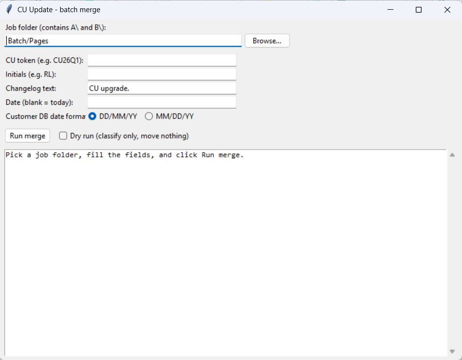
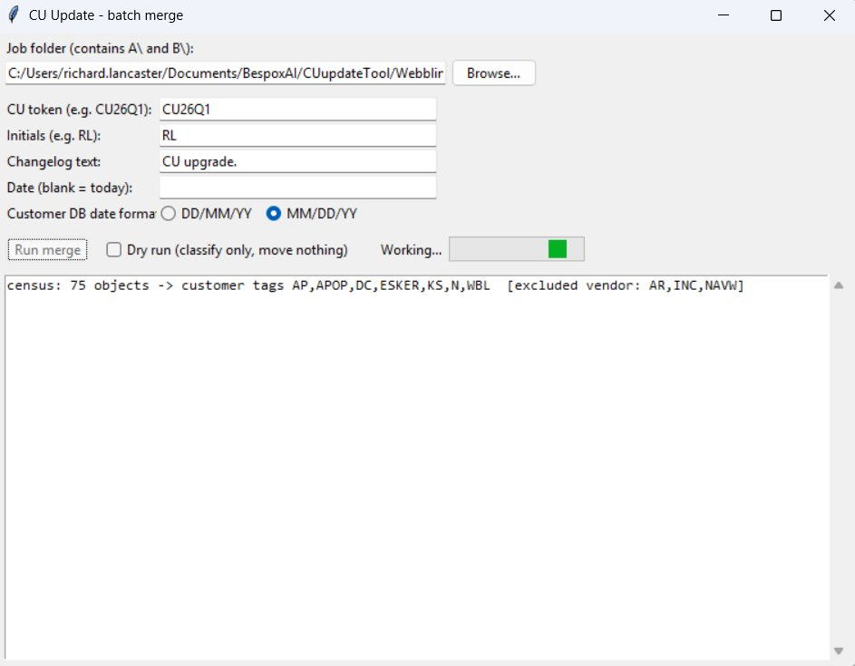
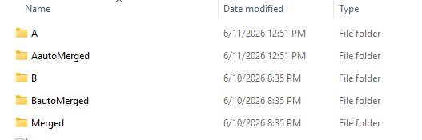
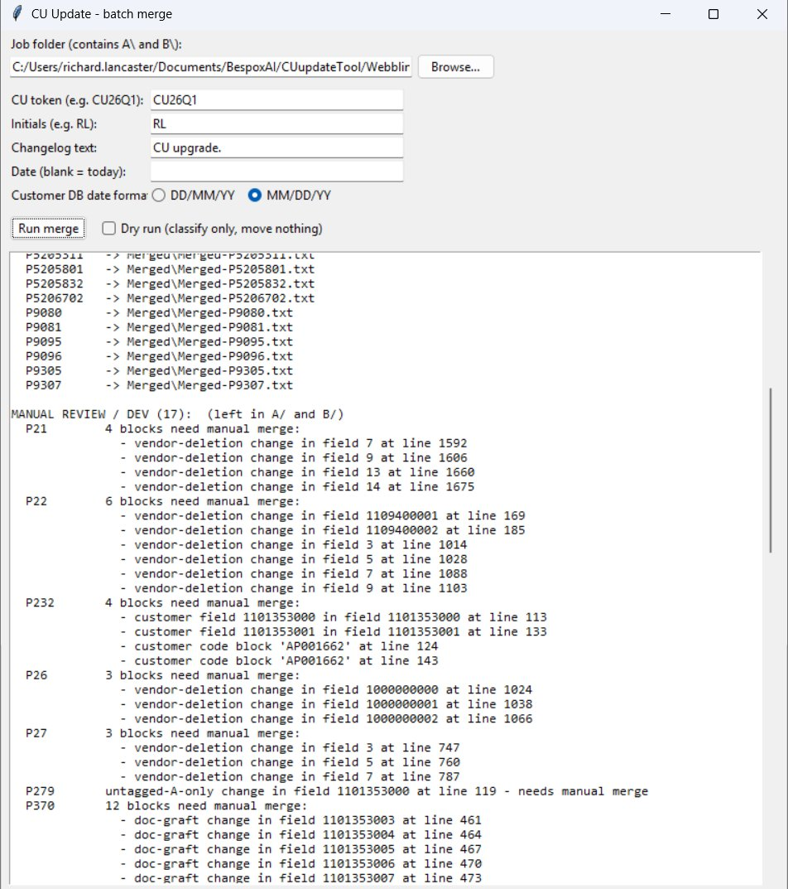

# CUupdateTool — User Manual

**Audience:** developers and managers using the tool for the first time.

**What it is:** a tool that carries a customer's C/AL customisations forward onto a new incadea
(idealer) cumulative update. It performs the mechanical majority of the merge automatically and
hands every genuine judgement call back to the developer for manual review.

This manual is task-oriented. Read sections 1 to 6 to run a job. Section 7 describes what is
inside the application. Section 8 is the **Rules Index by object type** — the reference that
explains, for each object type, what the tool carries forward, what it sends to manual review,
and why.

---

## 1. What the tool does

### 1.1 The problem it solves

incadea / BC-NAV **version 14** customers run **idealer** (the incadea standard application)
together with their own local customisations and localisations. When incadea ships a new
cumulative update, every customised object must be carried forward onto the new vendor version
by hand, one object at a time, in TortoiseMerge. This takes weeks for each customer, and most of
that time is spent on mechanical work — transplanting the customer's code, updating the version
list, and stamping the date and changelog — rather than on genuine judgement.

The tool performs the mechanical work automatically and routes only the genuine judgement calls
to the developer.

### 1.2 The A / B to C model

Where a merge is produced, it involves three objects:

- **A** is the customer's current object: the previous vendor version together with the
  customer's own code.
- **B** is the new cumulative update, or vendor-standard, object (idealer 2026Q1). It contains
  vendor code only, with no customer changes.
- **C** is the merged object the tool produces: the vendor content of B together with the
  customer content of A, placed correctly into the new context of B.

C is not simply "B with a few changes." A and B are equal inputs. The tool finds where each
piece of customer content belongs in B, takes that content from A, and writes both into C. B
itself is never altered — it is one of two read-only inputs.

A merge is not always required. When the vendor made no change to an object in this CU, the
customer's object A is already correct and no C is produced — see "No CU change" in section 5.2.

### 1.3 What the tool does not do

- It does not reconstruct a clean previous vendor object. It works only from A and B.
- It does not translate. Where the customer has a localisation language layer, the tool's goal
  is that the merged object **compiles**; translation accuracy remains the developer's
  responsibility.
- It does not make judgement calls. Anything the tool is not confident about is returned to the
  developer as a complete object, never partially merged.

### 1.4 The safety rule that governs everything: the whole-object gate

An object is merged automatically **only if every customer change within it is a confident,
mechanical carry**. If even one change is uncertain, the **entire object** is sent to manual
review unchanged. The tool never produces a partially merged object. This is why an
automatically merged object can be trusted, and why the developer only needs to merge by hand
the objects the tool has flagged.

---

## 2. Starting the tool

### 2.1 The application

The tool is a single Windows application, **`CUupdate_{{VERSION}}.exe`**. The machine it runs on does not
need any additional software installed — everything required is contained within the
application.

1. Copy `CUupdate_{{VERSION}}.exe` to the machine, or run it from where it is stored.
2. Double-click it.
3. The **CU Update — batch merge** window opens.

There is nothing to configure the first time it is run.



### 2.2 The window

| Field | Purpose |
|---|---|
| **Job folder** | The folder that contains the `A\` and `B\` sub-folders for this job. |
| **CU token** | The cumulative update being upgraded to, for example `CU26Q1`. It is recorded in the merge. |
| **Initials** | The developer's initials, for example `RL`. They are recorded in the changelog. |
| **Changelog text** | The standard text for the changelog entry. The default is `CU upgrade.` |
| **Date** | Leave blank to use today's date. |
| **Customer DB date format** | `DD/MM/YY` (the default) or `MM/DD/YY`. See section 4.3. |
| **Prefixes needing digits** | Optional. Comma-separated list of customer prefixes that should only be treated as a customer tag when followed by digits, for example `AP`. Leave blank if not needed. See section 4.6. |
| **Run merge** | Starts the job. |
| **Dry run** | Classifies the objects and produces the report, but writes and moves nothing. **Ticked by default** so the first run populates the Tag attribution lists for review. See section 5.1. |
| **Tag attribution** | Two lists (Customer tags / Excluded as vendor) populated after a dry run. Move a mis-attributed prefix with the **→** / **←** buttons. See section 4.5. |

The customer tags are determined by the tool automatically and are not entered by hand. See
section 4.4.

---

## 3. Preparing a job folder

The tool works on exported, language-stripped C/AL text files arranged in a fixed structure.
This is prepared once for each job.

### 3.1 The required folder structure

```
<job folder>\
    A\
        <Type>\
            EX-<stem>.txt      (the customer object, A)
    B\
        <Type>\
            CU-<stem>.txt      (the cumulative-update / vendor object, B)
```

- `<Type>` is the object-type folder name, for example `Table`, `Page`, `Codeunit` or `Report`.
  For a given object, A and B must use the **same** `<Type>` folder name.
- `<stem>` is the object-type letter followed by the object number:

  | Object type | Letter | Example object | Stem | A file | B file |
  |---|---|---|---|---|---|
  | Codeunit | `C` | Codeunit 80 | `C80` | `EX-C80.txt` | `CU-C80.txt` |
  | Table | `T` | Table 14 | `T14` | `EX-T14.txt` | `CU-T14.txt` |
  | Page | `P` | Page 21 | `P21` | `EX-P21.txt` | `CU-P21.txt` |
  | Report | `R` | Report 790 | `R790` | `EX-R790.txt` | `CU-R790.txt` |

- The **`EX-`** prefix identifies the customer (export) object. The **`CU-`** prefix identifies
  the cumulative-update / vendor object.
- Objects are paired by stem: `EX-T14.txt` pairs with `CU-T14.txt`.

A complete example:

```
C:\jobs\CustomerX\
    A\Table\EX-T14.txt
    A\Page\EX-P21.txt
    B\Table\CU-T14.txt
    B\Page\CU-P21.txt
```

### 3.2 Strip the language layer before export

The comparison must run on language-normalised text, so that the customer localisation layer
(for example, ENZ) does not interfere with the comparison.

In the normal workflow the language layer is **stripped within the NAV / GUI development
environment before the objects are exported** to text files. Export the customer objects with
the customer language layer already removed, so that the files placed into `A\` and `B\` are
already language-stripped. Keep a copy of the customer language layer, because it is re-applied
after the merge (see section 6.4).

For reference, the equivalent dev-shell cmdlets are:

- `Export-NAVApplicationObjectLanguage` — to keep a copy of the customer language layer for
  re-application later.
- `Remove-NAVApplicationObjectLanguage` — to remove the customer layer, leaving the development
  language, for a clean comparison.

The point to remember is that the tool's input files must already be language-stripped.

### 3.3 What to leave out of a job

- **Customer-range objects (object numbers 50000 to 99999)** belong to the customer's own
  licence range. They are not vendor objects being upgraded, so they are not included in a job.
  (Note that incadea's own `5025xxx` objects are a different range and **are** included. Note
  also that a customer field (not object) added inside a vendor object — for example field 50090 inside
  Table 36 — **is** carried forward; that is a customisation of a vendor object, not a
  customer-range object.)
- **"Killme" objects** — objects whose name contains the word `kill` — are retired by the tool
  automatically if they are present.

---

## 4. Running a merge

### 4.1 Steps

1. Double-click `CUupdate_{{VERSION}}.exe`.
2. Next to **Job folder**, click **Browse…** and select the folder that contains the `A\` and
   `B\` sub-folders.
3. Enter the **CU token** (for example `CU26Q1`) and your **Initials** (for example `RL`). These
   two fields are required.
4. Leave **Changelog text** as `CU upgrade.` unless different text is required.
5. Leave **Date** blank to use today's date.
6. Set **Customer DB date format** to match the customer database. See section 4.3.
7. If this customer has a short prefix that needs trailing digits (for example `AP`), enter it in
   **Prefixes needing digits**. Otherwise leave it blank. See section 4.6.
8. **Dry run** is ticked by default for the first pass. Leave it ticked. See section 5.1.
9. Click **Run merge**.
10. Read the report and check the **Tag attribution** lists. If any prefix is on the wrong
    side, move it with the **→** / **←** buttons (section 4.5) and click **Run merge** again.
    Once the attribution and the dry-run report are satisfactory, remove the **Dry run** tick
    and click **Run merge** to perform the merge.

### 4.2 What "Run merge" does

For each A and B pair in the job, the tool:

1. Determines the customer tags from the version lists of the A objects (section 4.4).
2. Compares A and B and classifies every difference, deciding for each object whether it needs no
   merge at all (the vendor changed nothing), can be merged automatically, or must go to manual
   review.
3. For each object the vendor did not change, copies A across unchanged and moves the source files
   aside (see "No CU change" in section 5.2).
4. For each automatically merged object, builds C, writes it out, and moves the source files
   aside.
5. For each manual object, leaves the source files in place and reports the reason.

While the tool is working, the window shows a progress indicator. It then prints the full report
and a summary line in the form `--- N auto-merged, K no CU change, M left for manual review ---`.



### 4.3 The two date formats

NAV records an object's header `Date=` value in the locale of the source database. The
**Customer DB date format** option tells the tool which locale the customer database uses:

- **`DD/MM/YY`** — the default, used by New Zealand and most incadea customers.
- **`MM/DD/YY`** — used by some customers.

This setting affects **only** the header `Date=` value. The changelog (documentation trigger)
date is **always** written as `DD.MM.YY`, regardless of this setting, because that is the
incadea convention and is independent of locale. The tool manages this distinction; the
developer only declares the header locale.

### 4.4 The customer tags are determined automatically

The tool determines the customer tags itself. On every run it reads the **version list** in the
header of each A object, extracts the tag prefixes, removes the known vendor prefixes, and uses
the remaining prefixes as the customer tag set. The first line of the report shows what was
found, for example:

```
census: 75 objects -> customer tags AP,APOP,DC,ESKER,KS,N,WBL  [excluded vendor: AR,INC,NAVW]
```

The customer tags are not entered by hand.

### 4.5 Correcting a mis-attributed tag (Tag attribution lists)

The split in section 4.4 is a **proposal**. The vendor filter is a first pass and
can occasionally put a prefix on the wrong side — a vendor prefix it did not
recognise ends up in the customer list, or a customer prefix it wrongly matched
ends up excluded as vendor. The **Tag attribution** panel lets you correct this.

After a dry run the panel shows two lists: **Customer tags** on the left and
**Excluded as vendor** on the right, each prefix with its occurrence count.
The lists are also filled **automatically when you select the job folder**, so
the proposed split is visible before you run anything.
To move a prefix, select it and click the arrow:

- **→** moves a prefix from Customer to Vendor. It will no longer gate customer
  code-block carries — use this for a vendor prefix the filter missed.
- **←** moves a prefix from Vendor to Customer. It will start gating customer
  carries — use this for a customer prefix the filter wrongly excluded.

Move the prefixes you need to correct, then run again so the correction takes
effect. The lists are cleared when you close the tool; a fresh dry run
repopulates them. Because the first run is a dry run by default (section 5.1),
you always get to review and correct the split before anything is written.

### 4.6 Prefixes that need trailing digits

This optional field controls **how a customer prefix is recognised in the body of an object**, and
works together with the automatic tags from section 4.4. It is a global setting for the job — an
addendum to the version list. The version list still decides *which* customer prefixes are in play;
this field tells the tool *what each one looks like* so it can be found wherever it appears.

Most customer prefixes are safe to recognise on their own. `WBL`, for example, is a letter
combination that never occurs inside an ordinary word, so the tool can treat any appearance of
`WBL` — in a procedure name such as `Evaluate_WBL`, in a comment, or as a tag — as customer-owned.

A few prefixes are short enough that they *would* appear inside ordinary words. `AP`, for instance,
occurs inside `Mapping` and `Application`. For these, enter the prefix in this field. The tool will
then treat the prefix as a customer tag **only when it is followed by digits** (for example
`AP001662`, `AP_001662`), and never when it appears inside a word. List several prefixes separated
by commas. Leave the field blank if no prefix needs this.

This recognition is what allows an object whose only changes are customer-added code — for example
a customer's own procedures appended to a codeunit — to be identified as needing no merge (section
5.2), even when that code carries no explicit tag comments.

---

## 5. Reading the results

### 5.1 Use Dry run first

The **Dry run** option classifies every object and prints the full report **without writing or
moving any files**. It is **ticked by default**, so the first run of any job is always a preview:
it shows which objects need no merge, which will be merged automatically, and which will be left
for manual review, and it populates the **Tag attribution** lists (section 4.5) so you can correct
the customer / vendor split before anything is changed. When the preview and the attribution are
satisfactory, remove the tick and run the merge.

### 5.2 Where the files go after a merge

| Outcome | Result |
|---|---|
| **Merged automatically** | C is written to `<job>\Merged\<Type>\Merged-<stem>.txt`. The two source files are moved to `<job>\AautoMerged\<Type>\` and `<job>\BautoMerged\<Type>\`. |
| **No CU change** | The vendor made no change to the object in this CU, so no merge is needed. The A file is copied **unchanged** (no stamp, no edit) to `<job>\NoCuChangesDetected\<Type>\`. The two source files are moved out of the worklist to `<job>\AnoCuChange\<Type>\` and `<job>\BnoCuChange\<Type>\`, each renamed with an `Unchanged_` prefix. |
| **Manual review** | The A and B files are left in place in `A\` and `B\`. |
| **Error or unmatched** | The files are left in place and listed in the report. One faulty object never stops the batch. |

This means that, after a merge, **whatever remains in `A\` and `B\` is exactly the manual
TortoiseMerge worklist**. Everything that merged automatically — or that needed no merge because the
vendor did not touch it — has been moved aside.

**About "No CU change".** Not every object needs merging. When the vendor ships a CU, many objects are
unchanged from the version the customer originally customised; for those, the customer's object is
already correct and there is nothing to carry forward. The tool recognises this by checking whether
**every** difference between A and B is explained by the customer's own tags and markers (a tagged
`Start..Stop` block, a `//`-tagged line, or a customer-added variable). If so — and only if so — it
treats the object as "no CU change" and copies A across untouched, saving the manual check that would
otherwise confirm "nothing to do". If **any** difference cannot be explained as a customer change, the
tool assumes the vendor changed something and sends the object down the normal merge path instead, so
this can never cause a real vendor change to be skipped.



### 5.3 The manual-review report

For each object sent to manual review, the report identifies it in plain language — by the field
and the line number — so that it can be found quickly in TortoiseMerge. An object with a single
item to merge is shown on one line. An object with several items lists each one, with a count so
that the amount of work is clear. For example:

```
MANUAL REVIEW / DEV (17):  (left in A/ and B/)
  P21      4 blocks need manual merge:
      - vendor-deletion change in field 7 at line 1592
      - vendor-deletion change in field 9 at line 1606
      - vendor-deletion change in field 13 at line 1660
      - vendor-deletion change in field 14 at line 1675
  P232     4 blocks need manual merge:
      - customer field 1101353000 in field 1101353000 at line 113
      - customer code block 'AP001662' at line 124
  P279     untagged-A-only change in field 1101353000 at line 119 - needs manual merge
```

Each line states precisely what the tool was not confident enough to merge automatically. The
meaning of each kind of item is described in section 8.



### 5.4 What the report tells you about the customer tags

The first line of the report (section 4.4) shows the customer tags the tool determined from the
version lists. The version list is the curated, authoritative source for these tags, so this is
the correct set in normal use. The customer tags affect whether a customer **code block** is
recognised during a merge, and also whether an object is recognised as needing **no merge** at all
(section 5.2 — that test attributes each difference to the customer's tags and markers); caption,
option, field and changelog carries do not depend on them. The report records the tags used so
that the run is documented and auditable.

---

## 6. After the merge

### 6.1 The automatically merged objects

The files in `Merged\<Type>\Merged-<stem>.txt` are completed merges, in language-stripped form.
They reproduce what a correct hand merge would produce for the cases the tool handles. They may
be spot-checked, but they are not part of the manual workload.

### 6.2 The manual objects

Work through whatever remains in `A\` and `B\` in TortoiseMerge in the usual way, using the
report (section 5.3) to go directly to each flagged item. This is the genuine-judgement subset,
and is typically a small proportion of the objects.

### 6.3 Join the objects by type

Combine the merged objects — both the automatically merged objects and those merged by hand —
by object type, into the import files normally produced.

### 6.4 Re-apply the language layer, then compile

The merged objects are language-stripped. Re-apply the customer language layer that was kept in
section 3.2, then import and compile. In the normal workflow this is done **within the NAV / GUI
development environment**, as part of the usual import and compile steps. The tool's
responsibility is that the object compiles cleanly after the language layer is re-applied; any
translation gaps are corrected as normal development work.

For reference, the equivalent dev-shell cmdlet is `Import-NAVApplicationObjectLanguage`.

---

## 7. Inside the application

The tool is normally used only through the window described above. This section describes what is
contained within the application, for background.

The application is built from a small set of Python modules, which are bundled together into the
single `CUupdate_{{VERSION}}.exe` file. No part of this is required at run time other than the application
itself.

| Component | Responsibility |
|---|---|
| Launcher | The window: collects the inputs, runs the merge, and shows the report. |
| Census | Determines the customer tags from the version lists of the A objects. |
| Batch driver | Runs the whole job, object by object. |
| Difference engine | Compares A and B and classifies every difference. |
| Anchor scorer | Decides whether a customer code block can be transplanted with confidence. |
| Executor | Builds the merged object C and performs the header and changelog bookkeeping. |

The application is produced once, on a Windows machine, from the project source. It is then
distributed as the single `CUupdate_{{VERSION}}.exe` file. End users are given the finished application and
do not build it themselves.

---

## 8. Rules Index by object type

This section is the reference for what the tool carries forward, what it sends to manual review,
and why. Each rule names the object it was validated against, so that the reasoning can be
checked.

The tool always works **difference-first**: it compares A against B to find every change, and
then justifies each change by its tag layer and its content. It never searches by tag first,
because that would miss changes that are untagged or unusually shaped. For each change it
produces one of three outcomes:

- **CARRY** — take the customer's content into C. This is mechanical and safe to automate.
- **TAKE B** — keep the vendor's content. This is a vendor upgrade that the customer did not
  change.
- **MANUAL** — send to manual review. This is a genuine judgement call.

The whole-object gate applies above all of these: if any change in an object is MANUAL, the
entire object goes to manual review.

### 8.0 Object-type dispatch (all object types)

The tool reads the object type from the first line of the object body
(`OBJECT <Type> <ID> <Name>`). This is authoritative; the file name and folder are not used to
determine the type. If A and B disagree on the type, or the header cannot be read, the object is
sent to manual review (a type mismatch). The tool never merges two objects of different types.

Each object type has its own handler. The current status is:

| Object type | Status | What runs |
|---|---|---|
| **Table** | Merges automatically | field graft, whole-procedure graft, code transplant, caption and option carry, description-tag carry, variable-declaration carry, changelog carry, header bookkeeping |
| **Codeunit** | Merges automatically | code transplant (placing each block at its correct nesting depth — including blocks at the tail of a procedure bracketed only by `END;` lines, and blocks whose surrounding code changed depth between versions), changelog carry, header bookkeeping (no field rules) |
| **Page** | Merges automatically | control-add graft, caption and option carry with a vendor-rename guard, variable-declaration carry, changelog carry |
| **Report** | Manual review only | the whole object is sent to manual review until a handler is built |
| **XMLport** | Manual review only | the whole object is sent to manual review until a handler is built |

An object type that is not yet validated sends the **whole object** to manual review **before
any rule runs**, so that no rule written for one type can ever be applied wrongly to another.

Before any per-type rule runs, the tool also applies the **no-CU-change** check (section 5.2): for
any type, if every difference between A and B is attributable to the customer's own tags and
markers, the vendor changed nothing and the object is set aside as "no CU change" rather than
merged. This is a short-circuit, not a per-type rule — it changes none of the rules below; it only
decides that they need not run for that object.

### 8.1 Table

A table is a hybrid object. It contains tagged C/AL code, in its triggers, and structure, in its
FIELDS section, where a customer field can be added with no code block at all. The full set of
rules applies.

#### 8.1.1 Customer field added to a vendor table — CARRY (field graft)

A field present in A, absent from B, and justified as a customer addition — either by a customer
description tag on the field, or by a changelog entry that names it — is grafted as a whole into
the FIELDS section of B, after the sibling field that still exists in B. The field's own code
travels with it; the code inside a new field's trigger is part of the field, not a separately
scored block.

- *Validated on Table 14:* customer field 50000 grafts cleanly. This is the basic and most
  common case.
- *Validated on Table 36:* the customer added fields 50090, 50091, 50096 and 50097, untagged,
  recorded in the changelog as "Added Consignment fields". These are carried forward, not
  dropped, because they are customisations of a vendor object — even though their numbers fall in
  the customer range. (The rule to exclude object numbers 50000 to 99999 applies to whole
  whole customer objects, not to customer fields added inside a vendor object.)
- *Validated on Table 36:* a customer field's own trigger code may be tagged with a ticket
  number that is not in the version list (field 50090's `OnValidate` is tagged `AP001691`, while
  the version list lists `AP001651`). Because the field is a customer addition — proven by its
  number and its absence from B — the trigger code travels with the field and is **not** checked
  against the customer-tag list. Ownership of the enclosing field is established first; the tag
  inside it is then only corroborating evidence, never the deciding factor.

#### 8.1.2 A whole customer procedure added to a vendor table — CARRY (procedure graft)

A `PROCEDURE` or `LOCAL PROCEDURE` whose name and id are present in A but absent from B can only
be a customer addition: the vendor never had it to upgrade. The whole procedure is carried
forward verbatim — its attribute line (for example `[Internal]`), its signature, its local
variable block, and its full body — and placed at the end of the object's CODE section, a
position that always compiles because procedure order does not matter in C/AL. The carry is
confirmed by a customer tag inside the procedure, so that a vendor procedure that was merely
renamed in the new version is never mistaken for a customer addition and duplicated.

- *Validated on Table 36:* `GetConsignmentBranchShipmentLines` is present in A, absent from B,
  and tagged `AP001651` in its body. It is carried forward whole. Its body code is not scored as
  a loose block — it travels with the procedure, the same way a new field's trigger code travels
  with the field.

#### 8.1.3 A changelog entry takes priority over a misleading vendor tag — CARRY

If a field that exists only in A carries a vendor-looking description tag, but a customer
changelog entry clearly identifies it as a customer addition, the changelog entry takes priority
and the field is carried forward.

- *Validated on Page 5025649:* a field carried a vendor description tag (`PA038441`), but the
  changelog entry "Add External Document No." was the true justification, so the field was
  carried rather than treated as a vendor deletion.

#### 8.1.4 A whole field, present only in A, with no tag and no changelog entry — MANUAL

A field that is present in A but not in B, with neither a customer tag nor a changelog entry, is
ambiguous: it could be a vendor deletion or a customer addition. Because a whole missing field
can fail quietly, it is sent to manual review rather than guessed.

- *Validated on Table 38:* field 70000, "RUID", is sent to manual review.

#### 8.1.5 A customer code block inside a changed shared field or trigger — the scorer decides

A customer-tagged code block (in the `// Start <TAG>` … `// Stop <TAG>` form, or the brace form)
inside a shared node is passed to the anchor scorer. The scorer decides between CARRY
(transplant) and MANUAL, according to whether the block's insertion point still exists, in a
coherent position, in B. There are three content classes:

- **Pure addition** — added lines only. Transplanted if the insertion point survives.
- **Vanilla modification** — a commented-out original vendor line together with a replacement.
  Transplanted only on a high score, and only when the overridden original still survives at the
  anchored position; otherwise sent to manual review. (In practice, all real vanilla
  modifications have been sent to manual review.)
- **Vanilla suppression** — a vendor line commented out with no replacement (the customer
  disabled vendor logic). **Always** sent to manual review, because re-suppressing vendor logic
  on the upgraded object is a human decision.

- *Validated on Codeunit 80:* a vanilla modification (a commented-out `TESTFIELD` override) is
  sent to manual review. This object also carries incadea's own tag defects (for example
  `// Srop PA035804`) identically in A and B; the tool must not stop on the vendor's own typing
  errors.
- *Validated on Table 39 and Report 790:* vanilla suppressions ("Remove short VIN check", a
  commented-out `END;`) are sent to manual review.
- *Validated on Table 80:* a CASE-branch code block in a field trigger transplants correctly once
  the insertion point is chosen as the closest valid pair of anchors.

#### 8.1.5a A carried code block lands in its own procedure, even when the anchor text repeats

When a customer code block sits inside a procedure, the point it transplants to is found **within
that same procedure**, never in a different one. This matters because the lines a block anchors
against are often vendor boilerplate that repeats — for example a `// Start PA036544` marker, or
the standard exit-point call, can appear at the end of several procedures in the same object. If
the tool searched the whole object for the nearest matching anchor, a block could be carried into
the wrong procedure: the text would match, but the surrounding variables would not exist there, and
the merged object would not compile.

The tool prevents this by first identifying the procedure the block belongs to in A, finding the
same procedure in B, and confining the search for the insertion point to that procedure. The
procedure is matched by its number first and its name second, so a procedure the vendor has renamed
(but not renumbered) is still recognised as the same procedure. If the procedure the block lives in
has been removed from the vendor object entirely, the block has nowhere safe to land and the whole
object is sent to manual review rather than guessed.

- *Validated on Table 17 (G/L Entry):* the customer's `// Start AP001994` block (which sets
  "Posted Description") sits at the end of `CopyFromGenJnlLine`. Its closing anchor, a
  `// Start PA036544` marker, also appears at the end of four other procedures in the same object.
  The block is carried into `CopyFromGenJnlLine`, where the `GenJnlLine` parameter it reads is in
  scope — not into one of the other procedures that share the same anchor text. (An earlier version
  of the tool carried this block into the wrong procedure.)

#### 8.1.5b A code block at the very end of a procedure, with only END; lines around it

A customer block sometimes sits as the **last statement of a procedure**, with nothing below it but
the `END;` lines that close the procedure. These `END;` lines are not distinctive — every block in
the object ends with them — so they cannot be used as a landmark to position the block. Without a
distinctive line below it, an earlier version of the tool could not work out where the block
belonged and sent the object to manual review, even though the placement was obvious to a developer
reading it.

The tool now positions such a block by its **structure** rather than by matching a line of text: it
counts how many `END;` lines sit between the block and the line above it in the customer's object,
then steps past the same number of `END;` lines in the vendor's object to find the matching spot.
Because the object compiles, its `END;` nesting is balanced, so this count carries across reliably —
and it does **not** depend on how the code is indented, which can vary between developers. The block
is placed after the correct `END;`, with its blank-line spacing kept tidy (a blank line is not
doubled up where the vendor's code already has one).

- *Validated on Codeunit 231 (Gen. Jnl.-Post):* the customer's Direct Credit customisation includes
  a `// Start DC5.00` block that is the last statement in the `Code` procedure, sitting just before
  the procedure's closing `END;`. It is now carried into the correct position automatically, exactly
  matching the hand-merged result. (An earlier version sent the whole object to manual review.)

#### 8.1.5c A code block that sits just outside a block of code, not inside it

The line a customer block is positioned against is sometimes **inside** a deeper block of code — an
`IF ... THEN BEGIN ... END`, a `CASE`, and so on — while the customer's block itself belongs
**outside** that block. The landmark line and the block are at different nesting depths. Reading only
the nearest line of text, an earlier version of the tool could place the block immediately after that
landmark, which dropped it *inside* the deeper block. That changes behaviour: code that should run on
every pass would instead run only when the inner block runs.

The tool now checks the **nesting depth** the block occupies in the customer's object and makes sure
the position it chooses in the vendor's object sits at the same depth. If the chosen landmark is
deeper, the tool steps forward past the closing lines (`END;`, `UNTIL`, the end of a `CASE`) until the
depth matches, and places the block there — outside the deeper block, where the customer wrote it.
Depth is read from the code's own `BEGIN`/`END`/`CASE` structure, ignoring anything inside comments or
text strings, and it does not depend on indentation. When the landmark is already at the block's own
depth, nothing is changed.

- *Validated on Codeunit 232 (Gen. Jnl.-Post+Print):* the customer's `// Start DC5.00` block assigning
  `DCRegNoG := "Line No.";` sits just after a posting-report `IF ... THEN BEGIN ... END` block, at the
  outer level. The nearest landmark line above it is the `REPORT.RUN(...)` call *inside* that block, two
  levels deeper. The tool now steps back out to the outer level and places the block there, exactly
  matching the hand-merged result. (An earlier version placed it inside the posting-report block.)

#### 8.1.6 A caption or option change — CARRY (always take the customer value)

On **any** difference in `CaptionML`, `OptionCaptionML` or `OptionString`, the customer value is
carried forward. No tag is required. This is low-risk and easy to verify in testing, so it is
always taken. The field's `Description=` tag list is carried with it, but only when the vendor's
tags are a subset of the customer's, so that a vendor-added tag is never lost.

- *Validated on Table 36:* fields 11 and 100, where the customer caption "Customer Order No."
  differs from the cumulative-update caption "Your Reference". The customer caption is kept.
- *Validated on Table 77 (Report Selections):* field 1, "Usage", where the customer had appended
  Direct Credit options to the option string and option caption. These are carried forward. (An
  earlier version of the tool incorrectly took the vendor value here.)

> A non-blocking warning is raised, but the carry still proceeds, if the vendor **also** changed
> the options in the middle of the list (that is, the vendor's option string is not a leading
> part of the customer's). A mid-list vendor change can shift the option ordinals, so the item is
> flagged for the developer to check.

#### 8.1.7 A field with both a code change and an option change — both are carried

A field can have both a customer code block in its trigger and an extended option or caption.
These are not treated as alternatives. The tool produces a scorer-routed code item and a caption
carry for the same field.

- *Validated on Table 80:* field 9, "Type", had both a CASE branch and an extended option string,
  option caption and description tag. Both are carried.

#### 8.1.8 Customer variable declarations — CARRY (keep rather than delete)

A variable declared in the VAR section of A — either the object-level (global) section, or a
procedure-level (local) section — but absent from the matching section of B, is carried forward.
The justification is compile-safety alone: a variable that is referenced but not declared fails
to compile, whereas a variable that is declared but unused is harmless. The tool therefore never
drops a declaration. The carry is performed silently and recorded, because it only ever adds. A
variable declaration carries no tag, so there is no source information to reason from; the rule
is simply to keep it.

- *Validated on Table 81:* a global variable, `VendBankAccG`, used by carried code, was being
  dropped. It is now carried forward so that the merged object compiles.

#### 8.1.9 A customer-extended option-string variable — CARRY

A variable present in both A and B, where both values are quoted text and the vendor's value is a
leading part of the customer's value (that is, the customer appended options), takes the
customer's value. A rename or a re-ordering is not a leading part of the value, so it fails this
test and is sent to the whole-object manual-review gate; the tool does not guess at it.

- *Validated on Page 347:* the customer's extension of the `ReportUsage2` option list is carried
  forward.

#### 8.1.10 Header and changelog bookkeeping (every automatic merge)

When the tool builds C, it also performs the mechanical bookkeeping a hand merge would:

- **Header:** it sets `Date=` to the merge date, in the declared database locale; reasserts
  `Modified=Yes`; preserves the `Time` value from B unchanged; and appends the CU token to the
  version-list tokens of A (A carries the customer tokens; B is the standard vendor object).
- **Placement:** customer content is inserted **after** the corresponding vendor content, which
  matches the established TortoiseMerge habit.
- **Changelog (documentation trigger):** the tool keeps B's entries, including the newest vendor
  entries; then appends the customer entries from A that are not already present in B, matched by
  exact line, so that this is independent of any tag prefix; then appends a single CU stamp line
  last, at the standard six-space indent. This is a combined list: it loses neither the vendor's
  new entries nor the customer's entries.

#### 8.1.11 Differences in tag spelling are standardised

A difference in tag spelling between the version list and the body (for example, `WBL-009` in the
body against `WBL009` in the version list) is matched without regard to hyphens or full stops,
and the **version-list spelling is treated as the standard form**. The difference is flagged, and
the merged object is written with the standard tag, so that the next upgrade reads a clean tag. A
plain `WBL` with no identifier is left as it is; the tool never invents an identifier.

### 8.2 Codeunit

A codeunit contains code only. It has no field nodes, so the field-graft, caption and option
rules do not apply; they are explicitly disabled, so that they can never be applied wrongly. What
runs is:

- **Customer code blocks** — passed to the scorer, exactly as in section 8.1.4 (pure addition,
  vanilla modification or vanilla suppression; CARRY or MANUAL according to whether the insertion
  point survives).
- **Customer variable declarations** — carried, as in section 8.1.7.
- **Changelog carry and header bookkeeping** — as in section 8.1.9.
- **An untagged region where A differs from B** — TAKE B. For code objects, tag discipline is
  reliable, so an untagged code difference is most likely the vendor's own change. This is the one
  remaining case where vendor content is taken without an explicit signal; it is accepted
  deliberately, and is confined to code objects, where tag discipline holds. It does not apply to
  pages or reports.

- *Validated on Codeunit 80 (Sales-Post):* customer vanilla modifications are sent to manual
  review; the vendor's own tag defects, present identically in A and B, are tolerated rather than
  stopped on.

### 8.3 Page

A page is a structure-bearing object: it consists of a tree of controls, captions and layout, and
is often untagged, because there is frequently no natural place for an inline code tag. The
absence of tags is therefore never read as "unchanged"; the tool works from the structural
comparison and the changelog. The page handler is validated: it merges confident cases
automatically and sends uncertain ones to manual review.

#### 8.3.1 A control added by the customer — CARRY (graft)

A control present in A, absent from B, and justified either by a changelog entry that names it or
by a customer tag, is grafted into the controls of B after the control that still exists in B.
This is structurally the same as a table field graft, with page spacing (pages separate sibling
controls with a blank line).

- *Validated on Page 14:* the customer added an "E-Mail" control, justified only by the changelog
  entry "Added E-Mail field", with no tag on the control itself. It is grafted after its anchor,
  the "Phone No." control, identically to the hand merge.
- *Validated on Page 21 (tagged version):* the four customer FactBoxes, carrying a customer tag,
  merge automatically as confident grafts, in the correct order even when several share one
  anchor.

#### 8.3.2 A vendor caption rename — TAKE B (do not carry the outdated customer caption)

If a caption or option difference exists, and B carries a vendor tag that A does not, the change
is vendor-driven: the vendor renamed it. The tool takes the vendor value, and does not carry the
customer's now-outdated value. This guard prevents the table-era rule of always carrying the
customer caption from overwriting a vendor rename.

- *Validated on Page 21:* controls where the vendor renamed "Quick Customer" to "New Quick
  Customer" and added a new vendor tag in B. The vendor value is taken.

#### 8.3.3 A control present only in A, carrying only a vendor tag — MANUAL

A control present only in A that carries **only** a vendor description tag is ambiguous: it could
be a genuine vendor deletion, or a customer-added control that happens to carry a vendor tag.
From the control alone, the tool cannot tell which, so it sends the object to manual review rather
than risk dropping a customer control.

- *Validated on Page 21:* FactBoxes recorded under a customer changelog entry but each carrying a
  vendor description tag are sent to manual review. When the same FactBoxes are given a customer
  tag (the tagged version of the page), the same object merges automatically, as in section 8.3.1.
  The customer tag is what resolves the ambiguity.

#### 8.3.4 A customer change to a property on a shared control — MANUAL

A customer change to a property on a control that exists in both A and B — for example, changing
`Visible` — is a modification, not a clean addition, and is sent to manual review.

- *Validated on Page 5025440:* the customer changed `Visible` from `FALSE` to `true` on a shared
  control. The object is sent to manual review.

#### 8.3.5 Caption capture on a page stops at the closing brace

On a page, a single-value caption can be the last property before the control's closing brace,
with no trailing semicolon (for example, `CaptionML=ENU=General }`). The tool stops reading the
caption value at the brace as well as at the semicolon, so that the brace is not read as part of
the value. (A table caption always ends at a semicolon, so this applies to pages only.)

The page handler also performs the variable-declaration carry (sections 8.1.7 and 8.1.8) and the
changelog and header bookkeeping (section 8.1.9).

### 8.4 Report and XMLport

Both report and XMLport objects are recognised but not yet validated. The whole object is sent to
manual review before any rule runs. The report describes this in plain language ("object type not
yet auto-merged by the tool — manual merge").

This is deliberately safe. It means that there is no path by which a report can be merged
incompletely. In particular, the RDLC layout case — for example, a report whose change is "Add
header and footer", where the change is held in a layout block that the comparison does not read —
is covered by the whole-object gate, not missed. A report or XMLport object will be merged
automatically only once its handler is built and validated against a real object.

### 8.5 Rules that apply to all object types

- **Killme objects are retired.** An object whose name contains the word `kill` is retired and is
  never written to the merged set. It is identified by its name, not by its version list or body
  tags.
- **Modified = No means take B.** If the header of A records that the customer never modified the
  object, the vendor object is taken.
- **An identical object means take B.** After the header bookkeeping, whitespace, line endings and
  language layer are normalised, if A is identical to B, there is nothing to carry.
- **Integrity is assessed by layer.** A malformed tag in a customer block stops the merge, because
  the block cannot be transplanted safely. A malformed tag in a vendor block is a warning only,
  because incadea ships its own tag defects (for example `// Srop PA035804`) identically in A and
  B, and the tool must not stop on the vendor's own errors.
- **Transplant is verbatim.** Customer blocks are inserted exactly as written, including their
  original indentation; the tool does not re-indent them. (A hand merge sometimes re-indents an
  inner `END;`; the tool's verbatim form still compiles, and can be tidied later.)
- **Encoding.** Files are in cp1252 / Latin-1 encoding. TortoiseMerge artefacts — carriage
  returns, trailing whitespace, and stray tabs in the changelog — are normalised.

---

## 9. Quick reference

**To run a job:** double-click `CUupdate_{{VERSION}}.exe`; select the folder that contains `A\` and `B\`;
enter the CU token and your initials; tick **Dry run**; click **Run merge**; review the report;
remove the tick; click **Run merge** again.

**After a merge:** the `Merged\` folder holds the completed objects; the `NoCuChangesDetected\`
folder holds objects the vendor did not change (A copied across unchanged); whatever remains in
`A\` and `B\` is the manual TortoiseMerge worklist; the report gives the field and line of each
flagged item.

**Then:** join the objects by type; re-apply the language layer in the development environment;
import and compile.

**Merges automatically at present:** Table, Codeunit and Page (confident cases).

**Always manual at present:** Report, XMLport, and any object containing a vanilla modification or
suppression, an ambiguous control carrying only a vendor tag, a property modification, or anything
the tool is not confident about.

**The guarantee:** if the tool is not confident, it returns the whole object unchanged. It never
merges an object incompletely.
